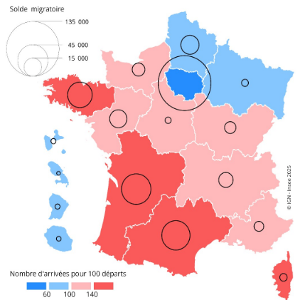
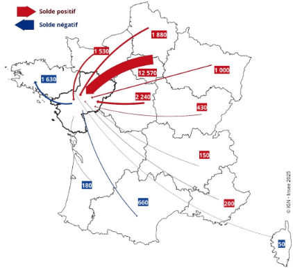

Avec des **soldes naturels** en berne, les dynamiques démographiques des régions reposent dorénavant sur les **migrations résidentielles**. Ces migrations, fondées sur de multiples motivations – mobilités professionnelles, études universitaires, retraite dans des zones de villégiature, rapprochements familiaux – ont une empreinte considérable sur la situation démographique et sociale des territoires. Les Pays de la Loire n’échappent pas à la règle. Les migrations résidentielles, excédentaires depuis plusieurs années, contribuent à la mue de la région.

# Pays de la Loire : un solde migratoire positif

En 2022, 77 800 habitants en provenance d’autres régions s’installent dans les Pays de la Loire. Dans le même temps, 63 300 Ligériens quittent la région, soit un **rapport entre les entrants et les sortants** de 123 arrivées pour 100 départs.\
Le **solde migratoire** est donc largement excédentaire (+14 500).
La région attire les générations d’actifs et leurs familles : 150 entrées pour 100 sorties pour les personnes de 30 à 64 ans, et 158 entrées pour 100 sorties pour les enfants de moins de 14 ans. Elle attire également les retraités, avec 150 entrées pour 100 sorties pour les 65 ans ou plus.
En revanche, les jeunes de 15 à 29 ans sont plus nombreux à quitter la région qu’à s’y installer, avec 94 entrées pour 100 sorties. En particulier, ceux âgés de 20 à 24 ans, qui rassemblent les étudiants et les jeunes actifs, sont le groupe d’âge le plus déficitaire, avec 87 entrées pour 100 sorties.\
Parmi les actifs, la région attire principalement les artisans, commerçants et chefs d’entreprise (140 entrées pour 100 sorties), les cadres et professions intellectuelles supérieures (135), et les professions intermédiaires (120). L’économie numérique contribue à ce phénomène : elle se développe et emploie principalement des ingénieurs et techniciens, notamment dans la zone d’emploi de Nantes.

Néanmoins, si la région est dans une situation favorable, avec un gain conséquent d’habitants, d’autres régions sont encore plus attractives : en premier lieu la Corse, suivie par la Bretagne, la Nouvelle-Aquitaine et l’Occitanie **▶︎ figure 1**.

## 1. Nombre d’entrées pour 100 sorties et solde migratoire par région en 2022

::: {#fig-1}
{width="100%"}

**Lecture** : La Corse compte 166 arrivants pour 100 sortants au cours de l’année 2022. Son solde migratoire est égal à +2 700. En Île-de-France, le solde migratoire est de -135 300 habitants.

**Source** : Insee, Enquête annuelle de recensement 2023.
:::

# L’attrait de la région s’étiole

Après avoir crû de façon constante entre 2012 et 2019, le rapport entre les entrants et les sortants baisse de 13 % entre 2019 et 2022 et revient à son niveau le plus faible sur les dix dernières années. Les départs des Pays de La Loire augmentent de 17,3 %, sensiblement plus que les arrivées (+2,5 %).

Ainsi la région recule à la 5e place pour le nombre d’arrivées pour 100 départs. Elle se situe derrière l’Occitanie, la Nouvelle-Aquitaine, la Bretagne et, en tête, la Corse. Parmi ces cinq régions, seuls les Pays de la Loire enregistrent une baisse, quand les régions du sud restent en essor.

L’attrait progresse dans les régions du sud. Entre 2019 et 2022, le rapport entre les entrants et les sortants augmente en Corse, en Occitanie et en Provence-Alpes-Côte d’Azur.

# Les espaces urbains séduisent moins depuis la Covid

Depuis 2019, l’attrait des **espaces urbains** ligériens décline, au profit des **espaces ruraux**. L’épidémie de Covid accentue ce déclin. Avec 114 entrées pour 100 sorties en 2022 (contre 138 en 2019), les espaces urbains n’ont jamais aussi peu attiré les Néo-ligériens.\
Les espaces ruraux, quant à eux, gagnent en attrait depuis 2017. Cette progression se conforte après l’épidémie de Covid, avec 136 et 142 entrées pour 100 sorties en 2021 et 2022 (contre 146 entrées en 2019).

# La région, attractive pour les Franciliens

La région attire principalement des Franciliens, avec un solde migratoire de +12 570 habitants, soit 70 % de l’excédent migratoire régional **▶︎ figure 2**. Ce solde est bien supérieur à celui de Centre-Val de Loire (+2 240 habitants), en deuxième position.

## 2. Flux et solde migratoires entre les Pays de la Loire et les autres régions métropolitaines en 2021

::: {#fig-2}
{width="100%"}

**Lecture** : En 2021, le solde entre le nombre de Franciliens arrivés dans les Pays de la Loire, et le nombre de Ligériens partis en Île-de-France est de +12 570 habitants.

**Source** : Insee, Recensement de la population 2022.
:::

Les Franciliens représentent 28 % des entrées sur le sol ligérien, alors que seuls 15 % des Ligériens quittent la région pour l’Île-de-France. L’attrait des Franciliens pour les Pays de la Loire ne cesse de progresser : 239 entrées pour 100 sorties en 2021, contre 198 en 2015.

`#colbreak()`{=typst}

Le solde migratoire a également fortement progressé avec les Hauts-de-France, troisième région de provenance des Néo-ligériens : +22 % entre 2015 et 2021, pour atteindre +1 880 habitants en 2022.\
En revanche, le solde des Pays de la Loire est déficitaire avec les régions métropolitaines les plus attractives. En particulier, les Ligériens partent de plus en plus vers la Bretagne, et le déficit d’attrait des Pays de la Loire se creuse : 88 arrivées pour 100 départs en 2021, contre 99 en 2015.`#pt-insee()`{=typst}

```{=typst}
#signature(auteurs:auteurs)
```

```{=typst}
#encadre[
  == Encadré - Chaque année, un Ligérien sur dix déménage

En 2023, un habitant des Pays de la Loire sur dix ne vit pas à la même
adresse qu’un an auparavant. Ce résultat reste stable sur la dernière
décennie. La plupart des mouvements sont intra-départementaux : 39 %
résidaient, un an plus tôt, dans une autre commune de leur département
et 33 % changent d’adresse dans la même commune ; 7 % habitaient déjà
la région, mais pas le même département ; 21 % sont des Néo-ligériens.

Depuis plusieurs années, les Ligériens qui déménagent au sein de la
région privilégient les espaces ruraux, au détriment des espaces urbains.
Ainsi, après un pic d’attrait des espaces urbains en 2017 (110 entrées pour
100 sorties), les Ligériens les délaissent progressivement.
Dès 2019, les espaces urbains deviennent déficitaires, mouvement qui s’accentue post-Covid (80 entrées pour 100 sorties en 2022). Dans les espaces ruraux, les logements sont plus spacieux, moins onéreux et, peut-être, davantage en proximité avec la nature. La Covid a sans doute eu un effet catalyseur d’une bascule commencée dès 2019.
]
```
```{=typst}
#definitions[
  == Définitions

*Solde naturel* : différence entre le nombre de naissances et le nombre
de décès enregistrés au cours d’une période.

*Migrations résidentielles* : changements de lieu de résidence au sein
de la France hors Mayotte, en dehors des changements de résidence
dans la même commune, entre l’année d’enquête et l’année
précédente.

*Solde migratoire* : différence entre le nombre de personnes qui sont
entrées sur le territoire et le nombre de personnes qui en sont sorties
au cours d’une période.

*Rapport entre les entrants et les sortants* : il mesure le nombre
d’entrées sur le territoire pour 100 sorties. S’il est supérieur à 100, les
personnes qui entrent dans le territoire sont plus nombreuses que
celles qui en sortent. S’il est inférieur à 100, les personnes qui en
sortent sont plus nombreuses que celles qui y entrent. Une
augmentation de ce ratio peut refléter une hausse des arrivées comme
une baisse des départs.

*Espace urbain* : il regroupe les communes qui concentrent un nombre
élevé d’habitants. Elles sont de tailles diverses : des grands centres
urbains, des centres urbains intermédiaires, des ceintures urbaines ou
des petites villes.

*Espace rural* : il regroupe les communes qui sont situées hors de
l’espace urbain, et dont la densité de population constitue un habitat
plus ou moins dispersé. L’espace rural inclut ainsi des communes de
type « bourgs ruraux », des communes d’habitat dispersé et des
communes d’habitat très dispersé.
]
```
```{=typst}
#pour-en-savoir-plus[
  == Pour en savoir plus

- *Coutard G., Morineau D.*, « #link("https://www.insee.fr/fr/statistiques/8627617")[Un tiers des habitants des Pays de la Loire ne sont pas nés dans la région]», Insee Flash Pays de la Loire n° 156, août 2025.
- *Brutel C.*, « #link("https://www.insee.fr/fr/statistiques/7637352")[En 2021, des déménagements un peu plus nombreux qu’avant la crise sanitaire depuis l’Île-de-France vers les autres régions]», Insee Première n° 1954, juin 2023.
- *Bouba-Olga O., Bouvard C.*, « #link("https://www.strategie-plan.gouv.fr/publications/exode-urbain-une-mise-vert-timide")[Exode urbain : une mise au vert timide]», Note d’analyse France stratégie n° 22, juin 2023.
]
```